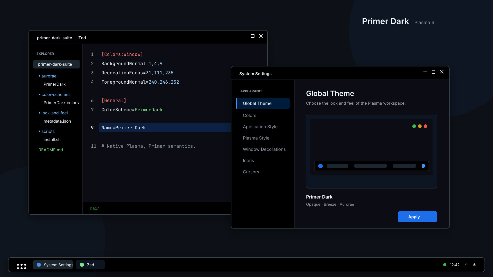

# Primer Dark Suite

An unofficial GitHub Primer Dark-inspired global theme for KDE Plasma 6.



## Included in v1

- complete KDE/Qt color scheme;
- native Breeze window decoration with Primer-colored titlebars, borders, and shadows;
- Plasma 6 Global Theme KPackage;
- Breeze application and Plasma styles;
- Breeze Dark icons and Breeze cursors;
- logo-free Plasma splash screen;
- System Settings previews and offline packaging scripts.

Primer Dark does **not** replace your panel layout, wallpaper, fonts, or window-button order. KDE Plasma Login theming is intentionally outside the v1 scope because login-manager integration is system-level and requires separate packaging and safety work.

## Requirements

- KDE Plasma 6
- `kpackagetool6`
- `plasma-apply-lookandfeel` when using `--apply`

The release and validation helper additionally uses `jq`, `xmllint`, and standard Unix archive tools.

## Install

```sh
./install.sh
```

Then select **Primer Dark** in **System Settings → Colors & Themes → Global Theme**.

To install and apply in one step:

```sh
./install.sh --apply
```

The installer writes only to the current user's XDG data directory, normally:

- `~/.local/share/color-schemes/PrimerDark.colors`
- `~/.local/share/aurorae/themes/PrimerDark/` (optional legacy Aurorae assets)
- `~/.local/share/plasma/look-and-feel/io.github.redasalmi.primerdark.desktop/`

## Uninstall

First select another Global Theme, then run:

```sh
./uninstall.sh
```

The script refuses to remove Primer Dark while it is active.

## Build release artifacts

The finished theme assets are committed and installation does not require a generator. To regenerate button SVGs after changing their source template:

```sh
./scripts/generate-buttons.py
```

Create installable archives and checksums with:

```sh
./scripts/package.sh
```

Artifacts are written to `dist/`.

## Design tokens

[`palette/primer-dark.json`](palette/primer-dark.json) is the canonical palette for this suite. The KDE v1 mapping uses these roles as follows:

| Role | Color |
| --- | --- |
| Chrome | `#010409` |
| Main surface | `#0D1117` |
| Muted surface | `#151B23` |
| Raised control | `#212830` |
| Border | `#3D444D` |
| Primary text | `#F0F6FC` |
| Muted text | `#9198A1` |
| Accent text | `#4493F8` |
| Focus and selection | `#1F6FEB` |
| Success | `#3FB950` |
| Warning | `#D29922` |
| Error | `#F85149` |

See [`plan.md`](plan.md) for the researched architecture and scope.

## Attribution

Color values are derived from [Primer Primitives](https://github.com/primer/primitives), licensed under MIT by GitHub, Inc. This independent project is not affiliated with or endorsed by GitHub.

See [`NOTICE`](NOTICE) for details.

## License

MIT
